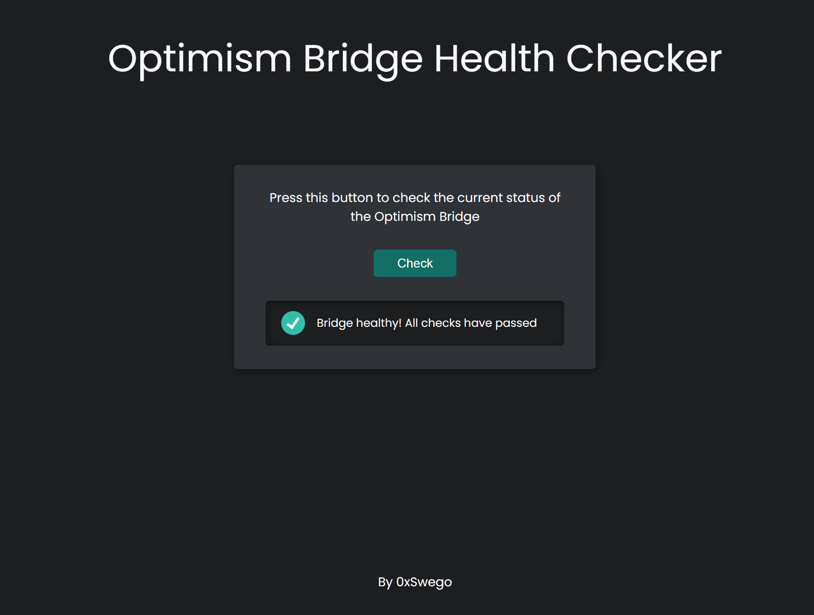

# Optimism Bridge Health Checker

[Live here](https://optimism-bridge-health-checker.onrender.com/)

## The Bridge Issue

Bridges are a fundamental, but particularly delicate piece of the DeFi ecosystem. Multiple hacks targeted bridges in the last years, resulting in billions of dollars of funds stolen (some of which have been recovered).

Due to their delicacy, it is opportune to keep an eye on bridges' health and make sure no red flags are raised before of using them. Although this way is not infallible, it helps reducing the chances to get caught in the middle of a hack or a disruptive event.

## Checking the Bridge health

Each bridge has its own inner functioning, but the gist is that users send funds from one side, where these funds will be locked/burned. An off-chain relayer will be listening to such events, and authorize the withdraw of funds on the other side, where they will be unlocked/minted. L1 to L2 bridges are a particularly simple instance of bridges, as there is only 1 link, (from L1, to L2). Multichain bridges present a tougher challenge as a multitude of chains would have to be taken into account.

A basic strategy to monitor any bridge health is to keep an eye on inflows vs outflows. For each one of the two sides:

-   If `outflows > inflows`, **there is a serious problem** and maybe a hack is taking place.
-   If `outflows < inflows * (1 - 𝛿)`, it seems that the bridge is unlocking funds slowly or not at all and **caution is recommended**.

Another strategy might be to monitor bridge-specific aspects. We'll keep it simple and just:

-   Check whether the relayer is `paused`. If that was the case, the bridge would become unusable and it would be best to wait some time before of using it.

## Further Developments

This piece of code is **not** final and just intended as an experiment. There is quite some room for improvement. For example, we could concatenate the following strategies:

-   Check the other way around as well (L2 to L1). As this takes much longer (1 week due to the challenge window) it is probably harder to hack and we'd have to analyze different windows of transactions (e.g. [now-24h:now] on L1 and [now-7days-24h:now-7days] on the L2). Apart from this detail, it's the same as we've already implemented.
-   Analyze `outflows` and `inflows` for ERC20 tokens, not only for ETH. We could get all the tokens deposited in the L1 and check them with all the tokens transferred from the L2.
